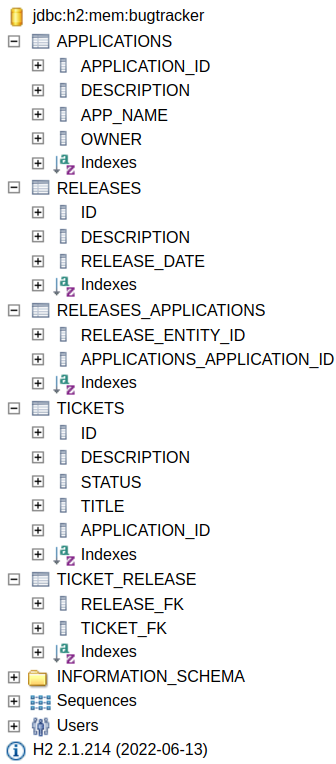

# BugTrackerSpringJpaH2

Spring + JPA + H2 DB - Demonstration

Done courses:

1. [Created based on course: Java Persistence API (JPA): 1 The Basics by Kesha Williams](https://www.linkedin.com/learning/java-persistence-api-jpa-1-the-basics/)

TO DO courses:

1. [Java Persistence API (JPA): 2 Inheritance and Querying by Kesha Williams](https://www.linkedin.com/learning/java-persistence-api-jpa-2-inheritance-and-querying)
2. [Kesha Williams](https://www.linkedin.com/learning/instructors/kesha-williams?u=2113185)
3. [Java-rock-star Kesha Williams](https://www.linkedin.com/in/java-rock-star-kesha)
4. [Java Persistence with JPA](https://www.linkedin.com/learning/java-persistence-with-jpa/map-java-objects-to-databases?autoplay=true&u=2113185)
5. [Java EE: Context and Dependency Injection](https://www.linkedin.com/learning/java-ee-contexts-and-dependency-injection/welcome?autoplay=true&u=2113185)
6. [Java EE: Bean Validation](https://www.linkedin.com/learning/java-ee-bean-validation/welcome?autoplay=true&u=2113185)
7. [Java EE: Design Patterns and Architecture](https://www.linkedin.com/learning/java-ee-design-patterns-and-architecture/advantages-and-disadvantages-of-microservices?autoplay=true&u=2113185)
8. [Java EE: JSON processing](https://www.linkedin.com/learning/json-processing-with-java-ee/welcome?autoplay=true&u=2113185)
9. [Java EE: WebSocket Programming](https://www.linkedin.com/learning/websocket-programming-with-java-ee/welcome?autoplay=true&u=2113185)
5. Hibernate
5. Spring MVC

### DB Schema

| Original DB Schema                                                             | Modified DB Schema                   |
|--------------------------------------------------------------------------------|--------------------------------------|
|  |  |

### Application run

1. Compile package  
   `mvn clean package -DskipTests`
    1. Or leave out `-DskipTests` flag to also run tests
2. Execute jar package  
   `java -jar ./target/BugTrackerSpringJpaH2_complete_standalone.jar`
3. Access application
    1. [Application status endpoint](http://localhost:8080/bug-tracker/status)
    2. [DB Console](http://localhost:8080/console/)

### TODO:

1. Jdbc prefilling of DB - replace with Jdbc Dao logic
2. Rename DB's tables, fields. Add screenshot of new DB schema.
3. (Not sure) Add Bidirectional references to entities where only unidirectional exist
4. Finish Non-Jta Ticket Dao
5. Have (Non-Jdbc) Ticket Dao Test run for all implementations (Jta, Non-Jta, SpringCrudRepository)
6. Finish TickerCrudRepositoryTest
    1. not rely on DaoTestHelper - do not share same entity manager
    2. why when running tests for whole application some (changing) number of tests fail
        1. Possible causes:
            1. Definatelly Jdbc tests are messing with JPA's logic
                1. Currently All Jdbc tests have connection rolled back
                2. Transactional tests are disabled because this data change breaks JPA tests
                    1. ID - most probable cause?
                        1. EntityManager is not aware of entities created using JDBC?
                    2. Structure of DB?
    3. Remove TicketCrudRepositoryTest.FIHandler
7. Make use of Dtos
    1. field validation
        1. @NotNull
        2. @Pattern
8. Cache-ing

### Git

1. Clone remote repository to local drive  
   `git clone https://github.com/axal25/BugTrackerSpringJpaH2.git`
2. Make changes
3. Add changes to the index  
   `git add .`
4. Verify the added changes  
   `git status`
6. Commit changes with message  
   `git commit -m 'msg'`
7. Verify commited changes  
   `git status`
8. Push changes made to remote repository branch called **main**    
   `git push -u origin main`

### Pass

1. Copy token to clipboard  
   `pass -c Git/axal25`